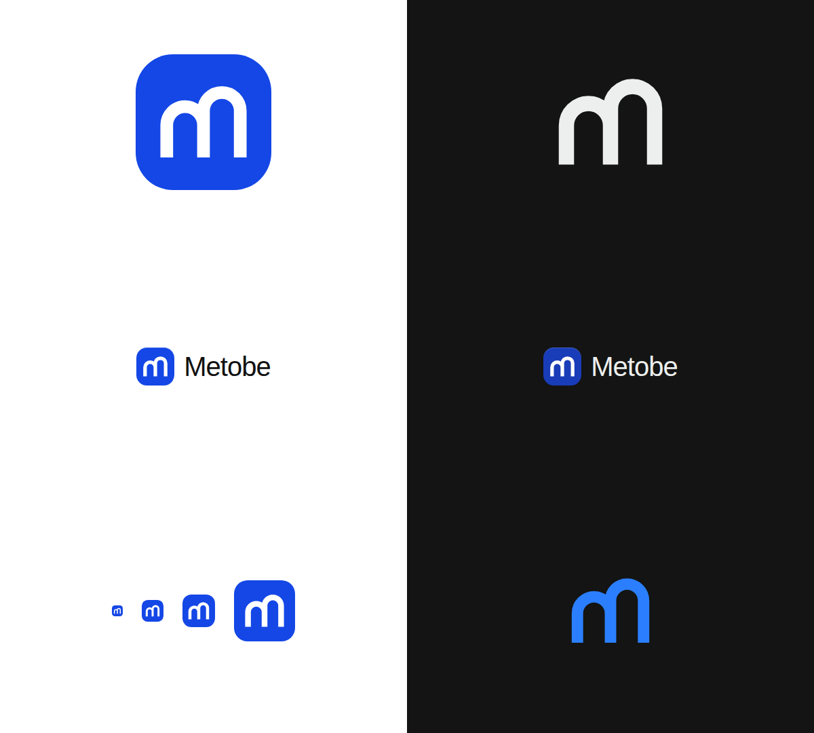

# Знак Metobe

Строчная **m**, у которой вторая арка стоит на ступень выше первой: «me → to be», шаг вверх. Больше в знаке ничего нет.

## Геометрия (сетка 24 × 24)

- Три ножки на x = 5.5 / 12 / 18.5 — равный шаг 6.5, знак центрирован по горизонтали.
- Обе арки одного радиуса 3.25; центр первой на y = 12.5, второй — на y = 10. Ступень 2.5 ≈ толщина штриха.
- Штрих 2.25, концы срезаны (butt), ножки заканчиваются на одной линии y = 18.25.
- Плитка — скругление 27.5 % стороны (rx 6.6 из 24). Оптический центр знака совпадает с центром плитки.

## Цвет

Только цвет бренда из `packages/ui/src/styles/globals.css`: `--primary` (светлая тема `oklch(0.488 0.243 264.376)` ≈ `#1447e6`) и белый знак на нём. Монохромная версия — `currentColor`, на любом нейтральном фоне. Других цветов, градиентов и теней нет.

## Файлы

| Файл | Для чего |
| --- | --- |
| `metobe-icon.svg` | иконка приложения: знак на плитке (копия `apps/web/app/icon.svg`) |
| `metobe-mark.svg` | знак без плитки в цвете бренда |
| `metobe-mark-mono.svg` | знак без плитки в `currentColor` |

В интерфейсе знак — компонент `BrandMark` (`apps/web/components/brand-mark.tsx`), его плитка берёт `--primary` темы. Словесная часть — «Metobe» набором Geist Semibold с трекингом `-0.025em` (`tracking-tight`), отступ от знака — 0.625rem.

## Нельзя

Растягивать, поворачивать, менять ступень или толщину, обводить, ставить знак на пёстрый фон без плитки.
